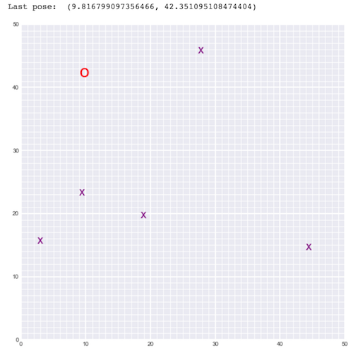

# Landmark Detection & Robot Tracking (SLAM)

## Project Overview

In this project, you'll implement SLAM (Simultaneous Localization and Mapping) for a 2 dimensional world! You’ll combine what you know about robot sensor measurements and movement to create a map of an environment from only sensor and motion data gathered by a robot, over time. SLAM gives you a way to track the location of a robot in the world in real-time and identify the locations of landmarks such as buildings, trees, rocks, and other world features. This is an active area of research in the fields of robotics and autonomous systems. 

*Below is an example of a 2D robot world with landmarks (purple x's) and the robot (a red 'o') located and found using *only* sensor and motion data collected by that robot. This is just one example for a 50x50 grid world; in your work you will likely generate a variety of these maps.*

<p align="center">
  
</p>

The project will be broken up into three Python notebooks; the first two are for exploration of provided code, and a review of SLAM architectures, **only Notebook 3 and the `robot_class.py` file will be graded**:

__Notebook 1__ : Robot Moving and Sensing

__Notebook 2__ : Omega and Xi, Constraints 

__Notebook 3__ : Landmark Detection and Tracking 


## Project Instructions

All of the starting code and resources you'll need to compete this project are in this Github repository. Before you can get started coding, you'll have to make sure that you have all the libraries and dependencies required to support this project. If you have already created a `cv-nd` environment for [exercise code](https://github.com/udacity/CVND_Exercises), then you can use that environment! If not, instructions for creation and activation are below.

### Local Environment Instructions

1. Clone the repository, and navigate to the downloaded folder.
```
git clone https://github.com/udacity/P3_Implement_SLAM.git
cd P3_Implement_SLAM
```

2. Create (and activate) a new environment, named `cv-nd` with Python 3.6. If prompted to proceed with the install `(Proceed [y]/n)` type y.

	- __Linux__ or __Mac__: 
	```
	conda create -n cv-nd python=3.6
	source activate cv-nd
	```
	- __Windows__: 
	```
	conda create --name cv-nd python=3.6
	activate cv-nd
	```
	
	At this point your command line should look something like: `(cv-nd) <User>:P3_Implement_SLAM <user>$`. The `(cv-nd)` indicates that your environment has been activated, and you can proceed with further package installations.

6. Install a few required pip packages, which are specified in the requirements text file (including OpenCV).
```
pip install -r requirements.txt
```


## Notebooks

1. Navigate back to the repo. (Also, your source environment should still be activated at this point.)
```shell
cd
cd P3_Implement_SLAM
```

2. Open the directory of notebooks, using the below command. You'll see all of the project files appear in your local environment; open the first notebook and follow the instructions.
```shell
jupyter notebook
```

3. Once you open any of the project notebooks, make sure you are in the correct `cv-nd` environment by clicking `Kernel > Change Kernel > cv-nd`.

__NOTE:__ While some code has already been implemented to get you started, you will need to implement additional functionality and answer all of the questions included in the notebook. __Unless requested, it's suggested that you do not modify code that has already been included.__


## Evaluation

Your project will be reviewed against the project [rubric](#rubric).  Review this rubric thoroughly, and self-evaluate your project before submission.  All criteria found in the rubric must meet specifications for you to pass.


## Project Submission

When you are ready to submit your project, collect all of your project files -- all executed notebooks, and python files -- and compress them into a single zip archive for upload.

Alternatively, your submission could consist of only the **GitHub link** to your repository with all of the completed files.

<a id='rubric'></a>
## Project Rubric

### `robot_class.py`: Implementation of `sense`

#### Implement the `sense` function
| Criteria       		|     Meets Specifications	        			            | 
|:---------------------:|:---------------------------------------------------------:| 
|  Implement the `sense` function for the robot class. |  Implement the `sense` function to complete the robot class found in the `robot_class.py` file. This implementation should account for a given amount of `measurement_noise` and the `measurement_range` of the robot. This function should return a list of values that reflect the measured distance (dx, dy) between the robot's position and any landmarks it sees. One item in the list has the format: `[landmark_index, dx, dy]`. |


### Notebook 3: Implementation of `initialize_constraints`

#### Initialize omega and xi matrices 
| Criteria       		|     Meets Specifications	        			            | 
|:---------------------:|:---------------------------------------------------------:| 
|  Initialize constraint matrices. |  Initialize the array `omega` and vector `xi` such that any unknown values are `0` the size of these should vary with the given `world_size`, `num_landmarks`, and time step, `N`, parameters. |


### Notebook 3: Implementation of `slam`

#### Update the constraint matrices as you read sensor measurements 
| Criteria       		|     Meets Specifications	        			            | 
|:---------------------:|:---------------------------------------------------------:| 
|  Iterate through the generated `data` and update the constraints. |  The values in the constraint matrices should be affected by sensor measurements *and* these updates should account for uncertainty in sensing. |

#### Update the constraint matrices as you read robot motion data 
| Criteria       		|     Meets Specifications	        			            | 
|:---------------------:|:---------------------------------------------------------:| 
|  Iterate through the generated `data` and update the constraints. |  The values in the constraint matrices should be affected by motion `(dx, dy)` *and* these updates should account for uncertainty in motion. |

#### `slam` returns a list of robot and landmark positions, `mu`
| Criteria       		|     Meets Specifications	        			            | 
|:---------------------:|:---------------------------------------------------------:| 
|  The result of slam should be a list of robot and landmark positions, `mu`. |  The values in `mu` will be the x, y positions of the robot over time and the estimated locations of landmarks in the world. `mu` is calculated with the constraint matrices `omega^(-1)*xi`. |


#### Answer question about final pose
| Criteria       		|     Meets Specifications	        			            | 
|:---------------------:|:---------------------------------------------------------:| 
|  Answer question about the final robot pose. |  Compare the `slam`-estimated and *true* final pose of the robot; answer why these values might be different. |

#### `slam` passes all tests

| Criteria       		|     Meets Specifications	        			            | 
|:---------------------:|:---------------------------------------------------------:| 
| Test your implementation of `slam`.  |  There are two provided test_data cases, test your implementation of slam on them and see if the result matches.|


LICENSE: This project is licensed under the terms of the MIT license.
